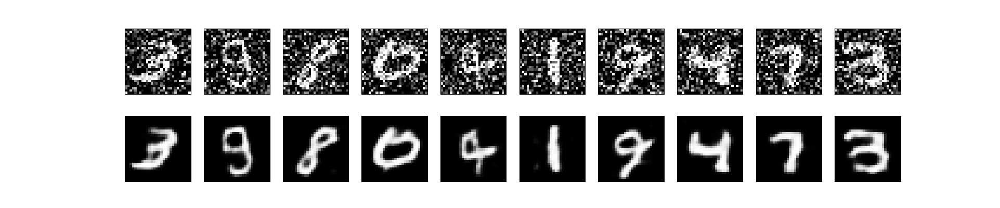
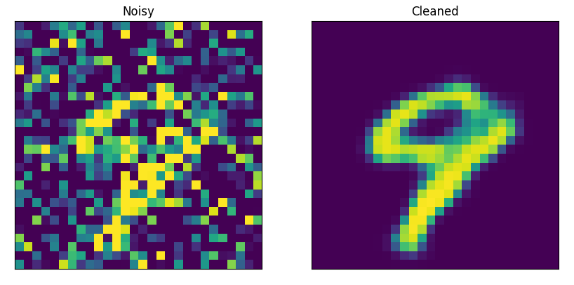

# autoEncoders

This example demonstrates how to implement a deep convolutional autoencoder for image denoising, mapping noisy digits images from the MNIST dataset to clean digits images

## For training the model

```bash
python mnist_autoencoders.py train
```

## Run and test the output

```bash
python mnist_autoencoders.py run
```

## Output



